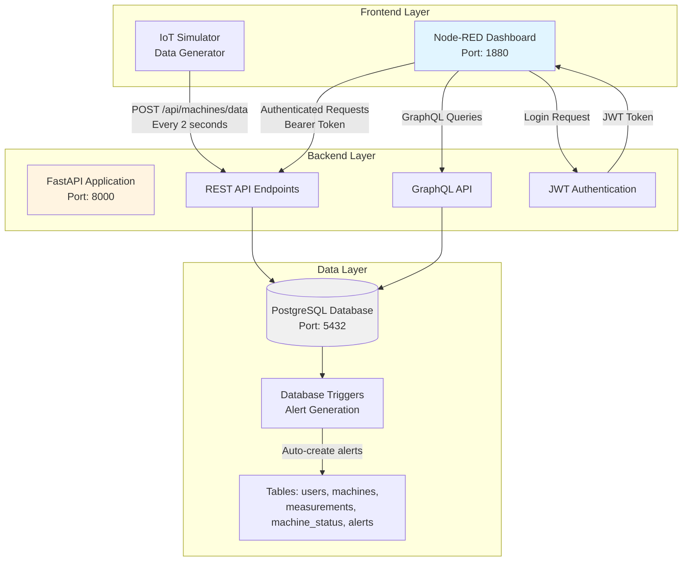
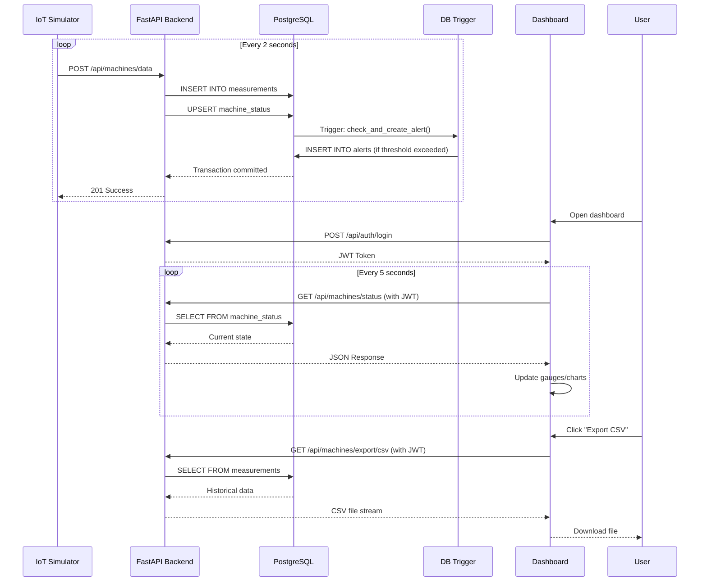

# Smart Production Line Monitoring System - Architecture Documentation

## 1. SYSTEM OVERVIEW

### Project Purpose

The Smart Production Line Monitoring System is an Industry 4.0 IoT solution designed to monitor and analyze real-time telemetry data from industrial manufacturing equipment. This system demonstrates the practical application of modern IoT architecture patterns, including real-time data acquisition, cloud-native backend services, and interactive visualization dashboards.

### Industry 4.0 Context

Industry 4.0 represents the fourth industrial revolution, characterized by the integration of cyber-physical systems, IoT, cloud computing, and cognitive computing in manufacturing environments. This project embodies these principles by:

- Collecting real-time telemetry from industrial machines
- Providing data-driven insights for predictive maintenance
- Enabling remote monitoring and control capabilities
- Implementing automated alerting for anomalous conditions
- Supporting historical data analysis and reporting

### Main Objectives

1. **Real-Time Monitoring**: Collect and display live telemetry data from three industrial machines (MX-01, MX-02, MX-03) at 2-second intervals
2. **Data Persistence**: Store all measurements in a PostgreSQL database for historical analysis
3. **Alert Generation**: Automatically detect and report critical conditions (high temperature, excessive vibration, equipment faults)
4. **API Access**: Provide both REST and GraphQL APIs for flexible data consumption
5. **User Authentication**: Implement secure JWT-based authentication for protected resources
6. **Data Visualization**: Deliver an intuitive Node-RED dashboard with real-time gauges, charts, and KPIs
7. **Reporting Capabilities**: Enable statistical analysis and CSV export functionality

## 2. ARCHITECTURE DIAGRAM



## 2.5 SYSTEM COMPONENT MAPPING

```mermaid
graph TB
    subgraph "Physical Host Machine"
        subgraph "Docker Container: PostgreSQL"
            PGDB[(PostgreSQL 15<br/>Container Name: postgres-sis4415<br/>Port Mapping: 5432:5432)]
            VOL[/Volume Mount:<br/>./postgres/init.sql]
        end

        subgraph "Node.js Runtime"
            NRED[Node-RED Server<br/>Port: 1880<br/>Flow Storage: flows/]
            DASH[Dashboard UI<br/>HTTP Endpoint]
            FLOW[Flow Execution Engine]
        end

        subgraph "Python Runtime"
            FAPI[FastAPI Server<br/>Uvicorn ASGI<br/>Port: 8000]
            SQLA[SQLAlchemy ORM]
            BERRY[Strawberry GraphQL]
        end
    end

    FLOW -->|TCP 8000| FAPI
    FAPI -->|TCP 5432<br/>Connection Pool| PGDB
    DASH -->|HTTP/WebSocket| NRED
    NRED -->|HTTP Client| FAPI
    VOL -.->|Initialize Schema| PGDB

    style PGDB fill:#336791,color:#fff
    style NRED fill:#8f0000,color:#fff
    style FAPI fill:#009688,color:#fff
```

### Network Communication Patterns

| Source | Destination | Protocol | Port | Purpose |
|--------|------------|----------|------|---------|
| Node-RED Simulator | FastAPI | HTTP/JSON | 8000 | POST telemetry data |
| Node-RED Dashboard | FastAPI | HTTP/JSON | 8000 | REST API queries |
| Node-RED Dashboard | FastAPI | HTTP/JSON | 8000 | GraphQL queries |
| FastAPI | PostgreSQL | PostgreSQL Wire Protocol | 5432 | Database operations |
| User Browser | Node-RED | HTTP/WebSocket | 1880 | Dashboard access |

### Data Persistence Layers

1. **Database Persistence**: PostgreSQL with ACID compliance
2. **Flow Configuration**: Node-RED flows stored as JSON files
3. **Authentication State**: JWT tokens stored in Node-RED flow context variables
4. **Connection Pooling**: SQLAlchemy connection pool (size: 10, max overflow: 20)

## 3. COMPONENT DESCRIPTIONS

### 3.1 Database Layer (PostgreSQL)

The database layer consists of five primary tables and supporting infrastructure including indexes, views, triggers, and functions.

#### Table Relationships

```mermaid
erDiagram
    users ||--o{ "protected_endpoints" : authenticates
    machines ||--o{ measurements : generates
    machines ||--|| machine_status : has_current
    machines ||--o{ alerts : triggers

    users {
        serial id PK
        varchar username UK
        varchar email UK
        varchar password_hash
        timestamp created_at
    }

    machines {
        serial id PK
        varchar machine_id UK
        varchar name
        varchar location
        varchar status
        timestamp created_at
    }

    measurements {
        serial id PK
        varchar machine_id FK
        decimal temperature
        integer vibration
        integer production_count
        boolean fault
        timestamp timestamp
        timestamp created_at
    }

    machine_status {
        varchar machine_id PK_FK
        decimal temperature
        integer vibration
        integer production_count
        boolean fault
        timestamp last_updated
    }

    alerts {
        serial id PK
        varchar machine_id FK
        varchar alert_type
        varchar severity
        text message
        boolean resolved
        timestamp created_at
        timestamp resolved_at
    }
```

#### Database Triggers

The system implements an automated alert generation mechanism using PostgreSQL triggers:

**Trigger: `trigger_alert_on_measurement`**
- **Event**: AFTER INSERT ON measurements
- **Purpose**: Automatically evaluate new measurements against safety thresholds
- **Logic**:
  - Temperature > 90°C: Create CRITICAL alert (type: high_temperature)
  - Vibration > 80: Create HIGH alert (type: high_vibration)
  - Fault = TRUE: Create CRITICAL alert (type: machine_fault)

This approach decouples alert logic from application code, ensuring consistent alert generation regardless of data source.

#### Complete Table Schemas

```sql
-- Users Table (Authentication)
CREATE TABLE users (
    id SERIAL PRIMARY KEY,
    username VARCHAR(50) UNIQUE NOT NULL,
    email VARCHAR(100) UNIQUE NOT NULL,
    password_hash VARCHAR(255) NOT NULL,
    created_at TIMESTAMP DEFAULT CURRENT_TIMESTAMP
);

-- Machines Table (Equipment Catalog)
CREATE TABLE machines (
    id SERIAL PRIMARY KEY,
    machine_id VARCHAR(20) UNIQUE NOT NULL,
    name VARCHAR(100) NOT NULL,
    location VARCHAR(100),
    status VARCHAR(20) DEFAULT 'active',
    created_at TIMESTAMP DEFAULT CURRENT_TIMESTAMP
);

-- Measurements Table (Time-Series Telemetry)
CREATE TABLE measurements (
    id SERIAL PRIMARY KEY,
    machine_id VARCHAR(20) REFERENCES machines(machine_id) ON DELETE CASCADE,
    temperature DECIMAL(5,2),
    vibration INTEGER,
    production_count INTEGER,
    fault BOOLEAN DEFAULT FALSE,
    timestamp TIMESTAMP NOT NULL,
    created_at TIMESTAMP DEFAULT CURRENT_TIMESTAMP
);

-- Index for efficient time-series queries
CREATE INDEX idx_measurements_machine_timestamp
ON measurements(machine_id, timestamp DESC);

-- Machine Status Table (Current State Snapshot)
CREATE TABLE machine_status (
    machine_id VARCHAR(20) PRIMARY KEY REFERENCES machines(machine_id) ON DELETE CASCADE,
    temperature DECIMAL(5,2),
    vibration INTEGER,
    production_count INTEGER,
    fault BOOLEAN DEFAULT FALSE,
    last_updated TIMESTAMP NOT NULL
);

-- Alerts Table (Event Log)
CREATE TABLE alerts (
    id SERIAL PRIMARY KEY,
    machine_id VARCHAR(20) REFERENCES machines(machine_id) ON DELETE CASCADE,
    alert_type VARCHAR(50) NOT NULL,
    severity VARCHAR(20) NOT NULL,
    message TEXT,
    resolved BOOLEAN DEFAULT FALSE,
    created_at TIMESTAMP DEFAULT CURRENT_TIMESTAMP,
    resolved_at TIMESTAMP
);

-- Index for unresolved alerts queries
CREATE INDEX idx_alerts_unresolved
ON alerts(resolved, created_at DESC) WHERE resolved = FALSE;
```

#### Database Views

The system provides three materialized views for optimized reporting:

1. **machine_stats_24h**: Aggregated statistics per machine for the last 24 hours
2. **active_alerts**: Current unresolved alerts with priority ordering
3. **system_overview**: System-wide KPIs and health metrics

#### Trigger Function Implementation

```sql
CREATE OR REPLACE FUNCTION check_and_create_alert()
RETURNS TRIGGER AS $$
BEGIN
    -- High temperature threshold
    IF NEW.temperature > 90 THEN
        INSERT INTO alerts (machine_id, alert_type, severity, message)
        VALUES (NEW.machine_id, 'high_temperature', 'critical',
                'Temperature exceeded 90°C: ' || NEW.temperature || '°C');
    END IF;

    -- High vibration threshold
    IF NEW.vibration > 80 THEN
        INSERT INTO alerts (machine_id, alert_type, severity, message)
        VALUES (NEW.machine_id, 'high_vibration', 'high',
                'Vibration exceeded safe threshold: ' || NEW.vibration);
    END IF;

    -- Machine fault condition
    IF NEW.fault = TRUE THEN
        INSERT INTO alerts (machine_id, alert_type, severity, message)
        VALUES (NEW.machine_id, 'machine_fault', 'critical',
                'Machine reported a fault condition');
    END IF;

    RETURN NEW;
END;
$$ LANGUAGE plpgsql;

CREATE TRIGGER trigger_alert_on_measurement
AFTER INSERT ON measurements
FOR EACH ROW
EXECUTE FUNCTION check_and_create_alert();
```

### 3.2 Backend Layer (FastAPI)

The backend provides a dual API architecture with both REST and GraphQL interfaces, secured by JWT authentication.

#### REST API Endpoints

**Authentication Endpoints**

| Method | Endpoint | Authentication | Description |
|--------|----------|----------------|-------------|
| POST | /api/auth/register | Public | Create new user account |
| POST | /api/auth/login | Public | Authenticate and receive JWT token |
| GET | /api/auth/me | Protected | Retrieve current user information |

**Machine Data Endpoints**

| Method | Endpoint | Authentication | Description |
|--------|----------|----------------|-------------|
| POST | /api/machines/data | Public | Receive telemetry from IoT simulator |
| GET | /api/machines | Protected | List all machines |
| GET | /api/machines/status | Protected | Get current status of all machines |
| GET | /api/machines/{machine_id}/measurements | Protected | Get measurement history for specific machine |
| GET | /api/machines/stats | Protected | Get aggregated statistics with time filtering |
| GET | /api/machines/measurements | Protected | Get all measurements with time range |
| GET | /api/machines/export/csv | Protected | Export measurements as CSV file |

**Alert Endpoints**

| Method | Endpoint | Authentication | Description |
|--------|----------|----------------|-------------|
| GET | /api/alerts | Protected | List alerts with optional filters |
| PATCH | /api/alerts/clear | Protected | Mark all unresolved alerts as resolved |
| PATCH | /api/alerts/{alert_id}/resolve | Protected | Resolve specific alert by ID |

**Health Check**

| Method | Endpoint | Authentication | Description |
|--------|----------|----------------|-------------|
| GET | /api/health | Public | System health status |

#### GraphQL API

The GraphQL endpoint is available at `/graphql` with an interactive GraphiQL interface.

**Available Queries**

```graphql
type Query {
  # Get all machines
  machines: [MachineType!]!

  # Get specific machine by ID
  machine(machineId: String!): MachineType

  # Get measurements with optional filtering
  measurements(machineId: String, limit: Int = 100): [MeasurementType!]!

  # Get current status of specific machine
  machineStatus(machineId: String!): MachineStatusType

  # Get current status of all machines
  allMachineStatuses: [MachineStatusType!]!
}
```

**Available Mutations**

```graphql
type Mutation {
  # Create new machine
  createMachine(machineInput: MachineInput!): MachineType!

  # Add new measurement
  addMeasurement(measurementInput: MeasurementInput!): MeasurementType!
}
```

**Available Subscriptions**

```graphql
type Subscription {
  # Subscribe to real-time machine updates
  machineUpdates(machineId: String): MachineStatusType!
}
```

**GraphQL Type Definitions**

```graphql
type MachineType {
  id: Int!
  machineId: String!
  name: String!
  location: String
  status: String!
  createdAt: DateTime!
}

type MeasurementType {
  id: Int!
  machineId: String!
  temperature: Float
  vibration: Int
  productionCount: Int
  fault: Boolean!
  timestamp: DateTime!
}

type MachineStatusType {
  machineId: String!
  temperature: Float
  vibration: Int
  productionCount: Int
  fault: Boolean!
  lastUpdated: DateTime!
}

input MachineInput {
  machineId: String!
  name: String!
  location: String
  status: String = "active"
}

input MeasurementInput {
  machineId: String!
  temperature: Float
  vibration: Int
  productionCount: Int
  fault: Boolean = false
  timestamp: DateTime
}
```

#### Authentication Mechanism (JWT)

**Token Generation Process**:
1. Client POSTs credentials to `/api/auth/login` using OAuth2 password flow
2. Backend verifies username/password using bcrypt hashing
3. On success, generates JWT token with 30-minute expiration
4. Token payload contains: `{"sub": "username", "exp": <timestamp>}`
5. Token signed using HS256 algorithm with secret key

**Token Validation Process**:
1. Client includes token in Authorization header: `Bearer <token>`
2. Protected endpoints extract token using FastAPI's `Depends(get_current_user)`
3. Token decoded and signature verified
4. Username extracted from `sub` claim
5. User object retrieved from database and attached to request context

**Security Implementation**:
- Password hashing: bcrypt with automatic salt generation
- Token signing: python-jose with cryptography backend
- Token expiration: 30 minutes (configurable via ACCESS_TOKEN_EXPIRE_MINUTES)
- Protected routes: Dependency injection via `get_current_user` function

### 3.3 Frontend Layer (Node-RED)

Node-RED serves dual purposes: IoT simulator and dashboard interface.

#### IoT Simulator

The simulator generates synthetic telemetry data for three machines at configurable intervals.

**Configuration Parameters**:
- **Machines**: MX-01, MX-02, MX-03
- **Generation Frequency**: 2000ms (2 seconds) per machine
- **Temperature Range**: 60-95 degrees Celsius (with configurable spike mode)
- **Vibration Range**: 15-85 (0-100 scale)
- **Production Count**: 10-20 units per minute
- **Fault Probability**: 5% random fault injection (configurable)

**Data Generation Flow**:
1. Inject node triggers every 2 seconds
2. Function node generates random telemetry within defined ranges
3. HTTP request node POSTs data to `/api/machines/data`
4. Response logged for debugging

**Sample Generated Payload**:
```json
{
  "machine_id": "MX-01",
  "temperature": 72.5,
  "vibration": 28,
  "production_count": 15,
  "fault": false,
  "timestamp": "2025-11-27T10:30:45.123Z"
}
```

#### Dashboard UI

The Node-RED dashboard consists of five primary tabs:

**1. Login Tab**
- Username and password input fields
- Login button triggering authentication flow
- Token storage in flow context variable
- Error message display for failed authentication

**2. Overview Tab**
- System KPIs: Total machines, active machines, total production, active alerts
- Machine status table with columns:
  - Machine ID
  - Temperature (with color coding)
  - Vibration level
  - Production count
  - Fault status
  - Last update timestamp
- Auto-refresh every 5 seconds

**3. Live Metrics Tab**
- Three gauge widgets (one per machine) showing:
  - Temperature gauge (0-100°C, red zone > 90°C)
  - Vibration gauge (0-100, yellow zone > 60, red zone > 80)
- Real-time line chart plotting temperature trends
- Real-time bar chart showing production counts
- Data refresh rate: 3 seconds

**4. Alerts Tab**
- Table displaying active alerts with columns:
  - Alert ID
  - Machine ID
  - Alert type
  - Severity (color-coded: critical=red, high=orange)
  - Message
  - Created timestamp
- Clear All Alerts button
- Individual alert resolution buttons
- Alert count badge

**5. Reports Tab**
- Date range picker for statistical queries
- Statistics display showing:
  - Total production
  - Average/Min/Max temperature
  - Average/Min/Max vibration
  - Fault count
  - Total readings
- CSV Export button
- Download functionality for production reports

## 4. DATA FLOW

The following sequence describes end-to-end data flow through the system:

### Step 1: Data Generation
Node-RED inject node triggers every 2 seconds, executing a function that generates random telemetry values within operational ranges for a specific machine ID.

### Step 2: Data Ingestion
HTTP request node POSTs JSON payload to `POST /api/machines/data` endpoint. This endpoint is intentionally public to simulate real IoT devices without authentication overhead.

### Step 3: Data Validation and Persistence
FastAPI endpoint handler:
1. Validates machine_id exists in machines table
2. Creates new Measurement record
3. Updates or creates MachineStatus record (current snapshot)
4. Commits transaction to PostgreSQL
5. Returns success confirmation

### Step 4: Automated Alert Generation
PostgreSQL trigger `trigger_alert_on_measurement` executes automatically:
1. Evaluates new measurement against thresholds
2. Inserts alert records if conditions met
3. All within same transaction (atomic operation)

### Step 5: Dashboard Query
Node-RED dashboard periodically queries authenticated endpoints:
- `GET /api/machines/status` for current state
- `GET /api/alerts?resolved=false` for active alerts
- `GET /api/machines/stats` for aggregated statistics

### Step 6: Data Visualization
Dashboard receives JSON responses and updates UI components:
- Gauges display current values
- Charts plot historical trends
- Tables list detailed records
- KPI cards show aggregated metrics

### Step 7: User Interaction
Users can:
- Clear alerts via `PATCH /api/alerts/clear`
- Generate reports via `GET /api/machines/stats`
- Export data via `GET /api/machines/export/csv`

### Data Flow Diagram



## 5. SECURITY ARCHITECTURE

### JWT Authentication Implementation

**Token Structure**:
```json
{
  "sub": "admin",
  "exp": 1732705845
}
```

**Token Lifecycle**:
1. **Generation**: On successful login at `/api/auth/login`
2. **Storage**: In Node-RED flow context (in-memory)
3. **Transmission**: Via Authorization header: `Bearer eyJ0eXAiOiJKV1QiLCJhbGc...`
4. **Validation**: On every protected endpoint request
5. **Expiration**: 30 minutes from issuance

### Protected vs Public Endpoints

**Public Endpoints** (No Authentication Required):
- `/api/auth/register` - User registration
- `/api/auth/login` - Authentication
- `/api/machines/data` - IoT data ingestion (simulates device authentication)
- `/api/health` - Health check
- `/` - API root

**Protected Endpoints** (JWT Required):
- All `/api/machines/*` except `/data`
- All `/api/alerts/*`
- `/api/auth/me`

### Authorization Checks

Protected endpoints utilize FastAPI's dependency injection:

```python
async def get_machines(
    current_user: User = Depends(get_current_user),
    db: Session = Depends(get_db)
):
    # current_user is automatically populated from JWT
    # If token invalid/expired, 401 Unauthorized returned
    machines = db.query(Machine).all()
    return machines
```

### Security Best Practices Implemented

1. **Password Storage**: Bcrypt hashing with automatic salting (never store plaintext)
2. **SQL Injection Prevention**: SQLAlchemy ORM with parameterized queries
3. **CORS Configuration**: Configured for development (allow all origins)
4. **Input Validation**: Pydantic schemas validate all request payloads
5. **Error Handling**: Generic error messages prevent information leakage
6. **Connection Pooling**: Prevents connection exhaustion attacks
7. **Token Expiration**: Automatic expiration reduces stolen token window

### Token Storage in Node-RED

```javascript
// Store token after successful login
flow.set("jwt_token", msg.payload.access_token);

// Retrieve token for authenticated requests
const token = flow.get("jwt_token");
msg.headers = {
    "Authorization": "Bearer " + token
};
```

## 6. TECHNOLOGY STACK

### Backend Technologies

| Component | Technology | Version | Purpose |
|-----------|-----------|---------|---------|
| Runtime | Python | 3.13.7 | Core programming language |
| Web Framework | FastAPI | 0.115.0 | Async web framework with automatic OpenAPI docs |
| ASGI Server | Uvicorn | 0.32.0 | High-performance async server |
| ORM | SQLAlchemy | 2.0.36 | Database abstraction and query builder |
| GraphQL | Strawberry GraphQL | 0.243.0 | GraphQL schema and resolver framework |
| Database Driver | psycopg | 3.2.3 | PostgreSQL adapter with binary protocol |
| Authentication | python-jose | 3.3.0 | JWT token generation and validation |
| Password Hashing | passlib | 1.7.4 | Password hashing with bcrypt support |
| | bcrypt | 4.2.1 | Bcrypt algorithm implementation |
| Data Validation | Pydantic | 2.9.2 | Data validation using Python type hints |
| Migration Tool | Alembic | 1.13.3 | Database schema migrations |
| Configuration | python-dotenv | 1.0.1 | Environment variable management |

### Database Technologies

| Component | Technology | Version | Purpose |
|-----------|-----------|---------|---------|
| RDBMS | PostgreSQL | 15 | Primary data store with ACID compliance |
| Container Runtime | Docker | Latest | Containerized database deployment |
| Database Client | DataGrip | N/A | Database IDE for development |

### Frontend Technologies

| Component | Technology | Version | Purpose |
|-----------|-----------|---------|---------|
| Runtime | Node.js | 22.20.0 | JavaScript runtime environment |
| IoT Platform | Node-RED | Latest | Flow-based programming for IoT |
| Dashboard | Node-RED Dashboard | Latest | UI components for visualization |
| Visualization | Chart.js | (via Dashboard) | Real-time charts and gauges |

### Development Tools

| Tool | Purpose |
|------|---------|
| Visual Studio Code | Primary code editor with Python extensions |
| DataGrip | Database management and SQL development |
| Postman | API testing and endpoint validation |
| Git | Version control system |
| Docker Desktop | Container management on Windows |

### Python Package Dependencies

```txt
fastapi==0.115.0
uvicorn[standard]==0.32.0
python-multipart==0.0.12
sqlalchemy==2.0.36
psycopg[binary]==3.2.3
alembic==1.13.3
strawberry-graphql[fastapi]==0.243.0
python-jose[cryptography]==3.3.0
passlib[bcrypt]==1.7.4
bcrypt==4.2.1
pydantic==2.9.2
pydantic-settings==2.6.1
python-dotenv==1.0.1
python-dateutil==2.9.0
pytz==2024.2
email-validator==2.1.0
```

## 7. KEY DESIGN DECISIONS

### Why PostgreSQL?

**Rationale**:
1. **ACID Compliance**: Ensures data consistency for financial production counts
2. **Advanced Features**: Triggers, stored procedures, and views enable database-level logic
3. **Time-Series Optimization**: Efficient indexing for timestamp-based queries
4. **Relational Integrity**: Foreign keys enforce referential integrity between tables
5. **Mature Ecosystem**: Excellent tooling, documentation, and community support
6. **JSON Support**: Native JSONB type available for future semi-structured data needs

**Alternative Considered**: InfluxDB (time-series database)
**Decision**: PostgreSQL chosen for ACID guarantees and relational features despite InfluxDB's time-series optimizations

### Why FastAPI?

**Rationale**:
1. **Async Performance**: Native async/await support for handling concurrent IoT data streams
2. **Automatic Documentation**: OpenAPI and JSON Schema generation reduces documentation overhead
3. **Type Safety**: Pydantic integration provides runtime type validation
4. **Modern Python**: Leverages Python 3.7+ type hints for better IDE support
5. **GraphQL Integration**: Strawberry GraphQL designed specifically for FastAPI
6. **Production Ready**: Used by Netflix, Uber, and Microsoft in production systems

**Alternative Considered**: Django REST Framework
**Decision**: FastAPI chosen for superior async performance and modern Python features

### Why Node-RED?

**Rationale**:
1. **Integrated Solution**: Single platform for both IoT simulation and dashboard
2. **Visual Programming**: Flow-based development accelerates IoT logic implementation
3. **Built-in Dashboard**: Native UI components eliminate need for separate frontend framework
4. **IoT Ecosystem**: Extensive library of nodes for industrial protocols (MQTT, OPC-UA, Modbus)
5. **Low Code**: Rapid prototyping without extensive JavaScript knowledge
6. **Academic Context**: Demonstrates understanding of IoT platforms beyond traditional web development

**Alternative Considered**: React + TypeScript + Socket.io
**Decision**: Node-RED chosen for integrated IoT capabilities and reduced development complexity

### Why JWT?

**Rationale**:
1. **Stateless**: No server-side session storage required, enabling horizontal scaling
2. **Self-Contained**: Token includes all necessary information (username, expiration)
3. **Industry Standard**: RFC 7519 specification with wide library support
4. **Cross-Domain**: Enables future microservices architecture with shared authentication
5. **Mobile Ready**: Token-based authentication compatible with mobile apps

**Alternative Considered**: Session-based authentication with cookies
**Decision**: JWT chosen for stateless architecture and scalability

### Database Trigger Approach

**Rationale**:
1. **Atomic Operations**: Alert generation in same transaction as measurement insert
2. **Single Source of Truth**: Business rules defined in database, not scattered across application layers
3. **Performance**: Database-level evaluation faster than application-level queries
4. **Consistency**: Alerts generated regardless of data source (API, direct insert, bulk import)
5. **Auditability**: Trigger logic versioned in init.sql migration file

**Alternative Considered**: Application-level alert generation in FastAPI
**Decision**: Database triggers chosen for atomicity and centralized business logic

**Trade-off**: Reduced application flexibility for business rule changes (requires migration), but gained consistency and performance

## 8. API ENDPOINTS REFERENCE

### REST API Complete Reference

| Method | Endpoint | Auth | Request Body | Response | Description |
|--------|----------|------|--------------|----------|-------------|
| **Authentication** |
| POST | /api/auth/register | No | `{"username": str, "email": str, "password": str, "full_name": str?}` | `{"id": int, "username": str, "email": str, "created_at": datetime}` | Register new user account |
| POST | /api/auth/login | No | Form data: `username`, `password` | `{"access_token": str, "token_type": "bearer"}` | Authenticate and receive JWT token |
| GET | /api/auth/me | Yes | N/A | `{"id": int, "username": str, "email": str}` | Get current authenticated user info |
| **Machines** |
| POST | /api/machines/data | No | `{"machine_id": str, "temperature": float, "vibration": int, "production_count": int, "fault": bool, "timestamp": datetime}` | `{"status": "success", "message": str, "machine_id": str, "timestamp": datetime}` | Receive telemetry data from IoT devices |
| GET | /api/machines | Yes | N/A | `[{"id": int, "machine_id": str, "name": str, "location": str, "status": str, "created_at": datetime}]` | List all registered machines |
| GET | /api/machines/status | Yes | N/A | `[{"machine_id": str, "temperature": float, "vibration": int, "production_count": int, "fault": bool, "last_updated": datetime}]` | Get current status snapshot of all machines |
| GET | /api/machines/{machine_id}/measurements | Yes | Query: `limit` (default: 100) | `[{"id": int, "machine_id": str, "temperature": float, "vibration": int, "production_count": int, "fault": bool, "timestamp": datetime}]` | Get measurement history for specific machine |
| GET | /api/machines/stats | Yes | Query: `start`, `end` (ISO datetime) | `{"total_production": int, "avg_temperature": float, "max_temperature": float, "min_temperature": float, "avg_vibration": float, "max_vibration": int, "min_vibration": int, "fault_count": int, "total_readings": int, "time_window": {...}}` | Get aggregated statistics with optional time filtering |
| GET | /api/machines/measurements | Yes | Query: `start`, `end`, `limit` (max: 5000) | `{"count": int, "measurements": [...]}` | Get all measurements across machines |
| GET | /api/machines/export/csv | Yes | Query: `start`, `end` | CSV file stream | Export measurements as downloadable CSV file |
| **Alerts** |
| GET | /api/alerts | Yes | Query: `resolved` (bool), `machine_id` (str) | `[{"id": int, "machine_id": str, "alert_type": str, "severity": str, "message": str, "resolved": bool, "created_at": datetime, "resolved_at": datetime?}]` | List alerts with optional filtering |
| PATCH | /api/alerts/clear | Yes | N/A | `{"status": "success", "message": str}` | Mark all unresolved alerts as resolved |
| PATCH | /api/alerts/{alert_id}/resolve | Yes | N/A | `{"status": "success", "message": str, "alert_id": int}` | Resolve specific alert by ID |
| **Health** |
| GET | /api/health | No | N/A | `{"status": "healthy", "timestamp": datetime}` | System health check endpoint |

### GraphQL Schema Reference

Access GraphQL playground at `http://localhost:8000/graphql`

**Sample Query: Get All Machines with Current Status**
```graphql
query GetMachinesOverview {
  machines {
    machineId
    name
    location
    status
  }
  allMachineStatuses {
    machineId
    temperature
    vibration
    productionCount
    fault
    lastUpdated
  }
}
```

**Sample Mutation: Add Measurement**
```graphql
mutation AddMeasurement {
  addMeasurement(measurementInput: {
    machineId: "MX-01"
    temperature: 75.5
    vibration: 30
    productionCount: 18
    fault: false
    timestamp: "2025-11-27T10:00:00Z"
  }) {
    id
    machineId
    temperature
    timestamp
  }
}
```

**Sample Subscription: Real-time Updates**
```graphql
subscription WatchMachine {
  machineUpdates(machineId: "MX-01") {
    machineId
    temperature
    vibration
    productionCount
    fault
    lastUpdated
  }
}
```

## 9. DATABASE SCHEMA DOCUMENTATION

### Entity-Relationship Diagram

```mermaid
erDiagram
    USERS {
        serial id PK
        varchar_50 username UK "Unique login identifier"
        varchar_100 email UK "User email address"
        varchar_255 password_hash "Bcrypt hashed password"
        timestamp created_at "Account creation time"
    }

    MACHINES {
        serial id PK
        varchar_20 machine_id UK "Equipment identifier (MX-01, MX-02, MX-03)"
        varchar_100 name "Machine display name"
        varchar_100 location "Physical location"
        varchar_20 status "Operational status (active/inactive)"
        timestamp created_at "Registration timestamp"
    }

    MEASUREMENTS {
        serial id PK
        varchar_20 machine_id FK "References machines.machine_id"
        decimal_5_2 temperature "Temperature in Celsius"
        integer vibration "Vibration level (0-100)"
        integer production_count "Units per minute"
        boolean fault "Fault flag"
        timestamp timestamp "Measurement time"
        timestamp created_at "Database insert time"
    }

    MACHINE_STATUS {
        varchar_20 machine_id PK_FK "References machines.machine_id"
        decimal_5_2 temperature "Current temperature"
        integer vibration "Current vibration"
        integer production_count "Current production rate"
        boolean fault "Current fault status"
        timestamp last_updated "Last update time"
    }

    ALERTS {
        serial id PK
        varchar_20 machine_id FK "References machines.machine_id"
        varchar_50 alert_type "Alert category"
        varchar_20 severity "critical, high, medium, low"
        text message "Alert description"
        boolean resolved "Resolution status"
        timestamp created_at "Alert creation time"
        timestamp resolved_at "Resolution time"
    }

    MACHINES ||--o{ MEASUREMENTS : "generates"
    MACHINES ||--|| MACHINE_STATUS : "has_current_state"
    MACHINES ||--o{ ALERTS : "triggers"
```

### Complete SQL Schema

```sql
-- ============================================
-- USERS TABLE
-- ============================================
CREATE TABLE users (
    id SERIAL PRIMARY KEY,
    username VARCHAR(50) UNIQUE NOT NULL,
    email VARCHAR(100) UNIQUE NOT NULL,
    password_hash VARCHAR(255) NOT NULL,
    created_at TIMESTAMP DEFAULT CURRENT_TIMESTAMP
);

-- Indexes
CREATE INDEX idx_users_username ON users(username);
CREATE INDEX idx_users_email ON users(email);

-- ============================================
-- MACHINES TABLE
-- ============================================
CREATE TABLE machines (
    id SERIAL PRIMARY KEY,
    machine_id VARCHAR(20) UNIQUE NOT NULL,
    name VARCHAR(100) NOT NULL,
    location VARCHAR(100),
    status VARCHAR(20) DEFAULT 'active',
    created_at TIMESTAMP DEFAULT CURRENT_TIMESTAMP
);

-- Indexes
CREATE INDEX idx_machines_machine_id ON machines(machine_id);
CREATE INDEX idx_machines_status ON machines(status);

-- ============================================
-- MEASUREMENTS TABLE (Time-Series Data)
-- ============================================
CREATE TABLE measurements (
    id SERIAL PRIMARY KEY,
    machine_id VARCHAR(20) REFERENCES machines(machine_id) ON DELETE CASCADE,
    temperature DECIMAL(5,2),
    vibration INTEGER,
    production_count INTEGER,
    fault BOOLEAN DEFAULT FALSE,
    timestamp TIMESTAMP NOT NULL,
    created_at TIMESTAMP DEFAULT CURRENT_TIMESTAMP
);

-- Indexes for time-series queries
CREATE INDEX idx_measurements_machine_timestamp
ON measurements(machine_id, timestamp DESC);

CREATE INDEX idx_measurements_timestamp
ON measurements(timestamp DESC);

-- ============================================
-- MACHINE_STATUS TABLE (Current State Snapshot)
-- ============================================
CREATE TABLE machine_status (
    machine_id VARCHAR(20) PRIMARY KEY REFERENCES machines(machine_id) ON DELETE CASCADE,
    temperature DECIMAL(5,2),
    vibration INTEGER,
    production_count INTEGER,
    fault BOOLEAN DEFAULT FALSE,
    last_updated TIMESTAMP NOT NULL
);

-- ============================================
-- ALERTS TABLE
-- ============================================
CREATE TABLE alerts (
    id SERIAL PRIMARY KEY,
    machine_id VARCHAR(20) REFERENCES machines(machine_id) ON DELETE CASCADE,
    alert_type VARCHAR(50) NOT NULL,
    severity VARCHAR(20) NOT NULL,
    message TEXT,
    resolved BOOLEAN DEFAULT FALSE,
    created_at TIMESTAMP DEFAULT CURRENT_TIMESTAMP,
    resolved_at TIMESTAMP
);

-- Indexes
CREATE INDEX idx_alerts_machine_id ON alerts(machine_id);
CREATE INDEX idx_alerts_unresolved
ON alerts(resolved, created_at DESC) WHERE resolved = FALSE;
CREATE INDEX idx_alerts_severity ON alerts(severity);

-- ============================================
-- CONSTRAINTS
-- ============================================
ALTER TABLE measurements
    ADD CONSTRAINT chk_temperature CHECK (temperature >= -50 AND temperature <= 200),
    ADD CONSTRAINT chk_vibration CHECK (vibration >= 0 AND vibration <= 100),
    ADD CONSTRAINT chk_production_count CHECK (production_count >= 0);

ALTER TABLE alerts
    ADD CONSTRAINT chk_severity CHECK (severity IN ('critical', 'high', 'medium', 'low'));

-- ============================================
-- TRIGGER FUNCTIONS
-- ============================================

-- Function: Automatic alert generation on threshold violations
CREATE OR REPLACE FUNCTION check_and_create_alert()
RETURNS TRIGGER AS $$
BEGIN
    -- High temperature alert (> 90°C = Critical)
    IF NEW.temperature > 90 THEN
        INSERT INTO alerts (machine_id, alert_type, severity, message)
        VALUES (
            NEW.machine_id,
            'high_temperature',
            'critical',
            'Temperature exceeded 90°C: ' || NEW.temperature || '°C'
        );
    END IF;

    -- High vibration alert (> 80 = High severity)
    IF NEW.vibration > 80 THEN
        INSERT INTO alerts (machine_id, alert_type, severity, message)
        VALUES (
            NEW.machine_id,
            'high_vibration',
            'high',
            'Vibration exceeded safe threshold: ' || NEW.vibration
        );
    END IF;

    -- Machine fault alert (Critical)
    IF NEW.fault = TRUE THEN
        INSERT INTO alerts (machine_id, alert_type, severity, message)
        VALUES (
            NEW.machine_id,
            'machine_fault',
            'critical',
            'Machine reported a fault condition'
        );
    END IF;

    RETURN NEW;
END;
$$ LANGUAGE plpgsql;

-- Function: Cleanup old measurements (data retention policy)
CREATE OR REPLACE FUNCTION cleanup_old_measurements()
RETURNS INTEGER AS $$
DECLARE
    deleted_count INTEGER;
BEGIN
    DELETE FROM measurements
    WHERE timestamp < NOW() - INTERVAL '30 days';

    GET DIAGNOSTICS deleted_count = ROW_COUNT;
    RETURN deleted_count;
END;
$$ LANGUAGE plpgsql;

-- ============================================
-- TRIGGERS
-- ============================================

-- Trigger: Automatic alert generation on new measurements
CREATE TRIGGER trigger_alert_on_measurement
AFTER INSERT ON measurements
FOR EACH ROW
EXECUTE FUNCTION check_and_create_alert();

-- ============================================
-- VIEWS FOR REPORTING
-- ============================================

-- View: 24-hour statistics per machine
CREATE VIEW machine_stats_24h AS
SELECT
    m.machine_id,
    m.name,
    m.location,
    COUNT(ms.id) as total_readings,
    ROUND(AVG(ms.temperature)::numeric, 2) as avg_temperature,
    ROUND(MAX(ms.temperature)::numeric, 2) as max_temperature,
    ROUND(MIN(ms.temperature)::numeric, 2) as min_temperature,
    ROUND(AVG(ms.vibration)::numeric, 2) as avg_vibration,
    MAX(ms.vibration) as max_vibration,
    MIN(ms.vibration) as min_vibration,
    SUM(ms.production_count) as total_production,
    COUNT(CASE WHEN ms.fault = TRUE THEN 1 END) as fault_count
FROM machines m
LEFT JOIN measurements ms ON m.machine_id = ms.machine_id
WHERE ms.timestamp > NOW() - INTERVAL '24 hours'
GROUP BY m.machine_id, m.name, m.location;

-- View: Active alerts with machine details
CREATE VIEW active_alerts AS
SELECT
    a.id,
    a.machine_id,
    m.name as machine_name,
    m.location,
    a.alert_type,
    a.severity,
    a.message,
    a.created_at,
    ROUND(EXTRACT(EPOCH FROM (NOW() - a.created_at))/60) as minutes_open
FROM alerts a
JOIN machines m ON a.machine_id = m.machine_id
WHERE a.resolved = FALSE
ORDER BY
    CASE a.severity
        WHEN 'critical' THEN 1
        WHEN 'high' THEN 2
        WHEN 'medium' THEN 3
        WHEN 'low' THEN 4
    END,
    a.created_at DESC;

-- View: System overview KPIs
CREATE VIEW system_overview AS
SELECT
    (SELECT COUNT(*) FROM machines WHERE status = 'active') as active_machines,
    (SELECT COUNT(*) FROM machines) as total_machines,
    (SELECT COUNT(*) FROM alerts WHERE resolved = FALSE) as active_alerts,
    (SELECT SUM(production_count) FROM machine_status) as current_total_production,
    (SELECT AVG(temperature) FROM machine_status) as avg_system_temperature,
    (SELECT MAX(vibration) FROM machine_status) as max_system_vibration;
```

### Sample Data Flow Through Tables

**Scenario: New measurement received for MX-01 with high temperature**

```sql
-- Step 1: Measurement inserted by FastAPI
INSERT INTO measurements (machine_id, temperature, vibration, production_count, fault, timestamp)
VALUES ('MX-01', 92.5, 35, 18, FALSE, '2025-11-27 10:15:30');

-- Step 2: Trigger automatically executes
-- check_and_create_alert() function evaluates:
--   - temperature (92.5) > 90 → TRUE → Insert alert

-- Step 3: Alert created automatically
INSERT INTO alerts (machine_id, alert_type, severity, message, resolved, created_at)
VALUES ('MX-01', 'high_temperature', 'critical',
        'Temperature exceeded 90°C: 92.5°C', FALSE, CURRENT_TIMESTAMP);

-- Step 4: Machine status updated (by FastAPI)
UPDATE machine_status
SET temperature = 92.5, vibration = 35, production_count = 18,
    fault = FALSE, last_updated = '2025-11-27 10:15:30'
WHERE machine_id = 'MX-01';

-- Step 5: Dashboard queries data
SELECT * FROM machine_status;
SELECT * FROM alerts WHERE resolved = FALSE;
```

### Data Retention Policy

- **Measurements**: 30-day retention (manual cleanup via `cleanup_old_measurements()` function)
- **Alerts**: Indefinite retention (resolved alerts kept for audit trail)
- **Machine Status**: Latest state only (UPSERT behavior)
- **Users**: Indefinite retention

## 10. DEPLOYMENT ARCHITECTURE

### Local Development Setup

The system is deployed locally with the following architecture:

```
Host Machine (Windows 10/11)
├── Docker Desktop
│   └── PostgreSQL Container
│       ├── Image: postgres:15
│       ├── Container Name: postgres-sis4415
│       ├── Port Mapping: 5432:5432
│       ├── Volume Mount: ./postgres/init.sql → /docker-entrypoint-initdb.d/
│       └── Environment Variables:
│           ├── POSTGRES_DB=sis4415_db
│           ├── POSTGRES_USER=sis4415_user
│           └── POSTGRES_PASSWORD=<password>
│
├── Python 3.13.7 Environment
│   └── FastAPI Application
│       ├── Entry Point: api/main.py
│       ├── Run Command: uvicorn api.main:app --reload --host 0.0.0.0 --port 8000
│       ├── Listening On: http://localhost:8000
│       ├── Workers: 1 (development mode)
│       └── Database Connection: postgresql://sis4415_user:<password>@localhost:5432/sis4415_db
│
└── Node.js v22.20.0 Environment
    └── Node-RED Application
        ├── Run Command: node-red
        ├── Listening On: http://localhost:1880
        ├── Flow Storage: ~/.node-red/flows/complete_integrated_flow.json
        └── Dashboard UI: http://localhost:1880/ui
```

### Docker Configuration

**PostgreSQL Container Startup**:
```bash
docker run -d \
  --name postgres-sis4415 \
  -e POSTGRES_DB=sis4415_db \
  -e POSTGRES_USER=sis4415_user \
  -e POSTGRES_PASSWORD=<password> \
  -p 5432:5432 \
  -v ./postgres/init.sql:/docker-entrypoint-initdb.d/init.sql \
  postgres:15
```

**Database Initialization**:
- On first startup, PostgreSQL executes `init.sql` from mounted volume
- Creates all tables, indexes, views, functions, and triggers
- Inserts initial machine data (MX-01, MX-02, MX-03)

### FastAPI Startup

**Development Mode**:
```bash
# Activate virtual environment
python -m venv venv
source venv/bin/activate  # Windows: venv\Scripts\activate

# Install dependencies
pip install -r requirements.txt

# Run FastAPI
uvicorn api.main:app --reload --host 0.0.0.0 --port 8000
```

**Environment Variables** (`.env` file):
```env
DATABASE_URL=postgresql://sis4415_user:<password>@localhost:5432/sis4415_db
SECRET_KEY=<jwt-secret-key>
ALGORITHM=HS256
ACCESS_TOKEN_EXPIRE_MINUTES=30
```

### Node-RED Startup

```bash
# Install Node-RED globally
npm install -g node-red

# Install dashboard nodes
cd ~/.node-red
npm install node-red-dashboard

# Start Node-RED
node-red
```

**Flow Import**:
1. Navigate to http://localhost:1880
2. Menu → Import → Select `flows/complete_integrated_flow.json`
3. Deploy flows
4. Access dashboard at http://localhost:1880/ui

### Service Ports Summary

| Service | Port | Protocol | Access URL |
|---------|------|----------|------------|
| PostgreSQL | 5432 | TCP | localhost:5432 (database clients) |
| FastAPI | 8000 | HTTP | http://localhost:8000 |
| FastAPI Docs | 8000 | HTTP | http://localhost:8000/docs (Swagger UI) |
| GraphQL Playground | 8000 | HTTP | http://localhost:8000/graphql |
| Node-RED Editor | 1880 | HTTP | http://localhost:1880 |
| Node-RED Dashboard | 1880 | HTTP | http://localhost:1880/ui |

### Network Communication

All services communicate over localhost loopback interface:
- **Node-RED → FastAPI**: HTTP requests to `http://localhost:8000`
- **FastAPI → PostgreSQL**: PostgreSQL wire protocol to `localhost:5432`
- **Browser → Node-RED**: HTTP/WebSocket to `http://localhost:1880`
- **Browser → FastAPI**: Direct API access to `http://localhost:8000` (optional)

### System Startup Sequence

1. **Start PostgreSQL**: `docker start postgres-sis4415` (or run command if first time)
2. **Verify Database**: Check logs for successful schema initialization
3. **Start FastAPI**: `uvicorn api.main:app --reload`
4. **Verify API**: Open http://localhost:8000/docs to confirm OpenAPI documentation loads
5. **Start Node-RED**: `node-red`
6. **Import Flows**: Load `complete_integrated_flow.json` if not already imported
7. **Deploy Flows**: Click Deploy button in Node-RED editor
8. **Access Dashboard**: Navigate to http://localhost:1880/ui
9. **Login**: Use credentials to authenticate (default: admin/admin)
10. **Verify Data Flow**: Check Overview tab to confirm simulator is sending data

### Monitoring and Logs

**FastAPI Logs**:
- Console output from Uvicorn server
- Shows HTTP request logs, query execution times, errors

**Node-RED Logs**:
- Console output from Node-RED runtime
- Debug panel in editor shows flow execution
- Debug nodes in flows log specific events

**PostgreSQL Logs**:
```bash
docker logs postgres-sis4415
```

### Troubleshooting Common Issues

| Issue | Symptom | Solution |
|-------|---------|----------|
| Database Connection Failed | FastAPI: "could not connect to server" | Verify PostgreSQL container is running: `docker ps` |
| Port Already in Use | "Address already in use" error | Kill process using port or change port number |
| JWT Authentication Failed | 401 Unauthorized on protected endpoints | Verify token not expired, check SECRET_KEY matches |
| Node-RED Dashboard Blank | Empty dashboard UI | Import flows, click Deploy, refresh browser |
| No Data in Dashboard | Gauges show zero | Verify simulator inject nodes are enabled and triggering |

### Production Deployment Considerations

For academic demonstration, local deployment is sufficient. For production deployment, consider:

1. **Containerize FastAPI**: Create Dockerfile for FastAPI application
2. **Use Docker Compose**: Orchestrate all services (PostgreSQL, FastAPI, Node-RED)
3. **Environment Secrets**: Use Docker secrets or Kubernetes secrets for credentials
4. **Reverse Proxy**: Nginx or Traefik for SSL termination and load balancing
5. **Database Backups**: Automated pg_dump schedules
6. **Monitoring**: Prometheus + Grafana for system metrics
7. **Log Aggregation**: ELK stack or Loki for centralized logging
8. **CI/CD Pipeline**: GitHub Actions or GitLab CI for automated deployments
9. **Horizontal Scaling**: Multiple FastAPI instances behind load balancer
10. **CDN**: CloudFlare or AWS CloudFront for static assets

---

## Document Metadata

- **Author**: Anibal Simeon Falcon Castro
- **Project**: Smart Production Line Monitoring System (Industry 4.0)
- **Course**: SIS4415 - Information in the Fourth (Industrial Revolution)
- **Institution**: Universidad Anáhuac México
- **Date**: 27 November 2025


## References

- FastAPI Documentation: https://fastapi.tiangolo.com/
- SQLAlchemy Documentation: https://docs.sqlalchemy.org/
- Strawberry GraphQL: https://strawberry.rocks/
- Node-RED Documentation: https://nodered.org/docs/
- PostgreSQL 15 Documentation: https://www.postgresql.org/docs/15/
- JWT RFC 7519: https://datatracker.ietf.org/doc/html/rfc7519
- Industry 4.0 Principles: https://en.wikipedia.org/wiki/Fourth_Industrial_Revolution
